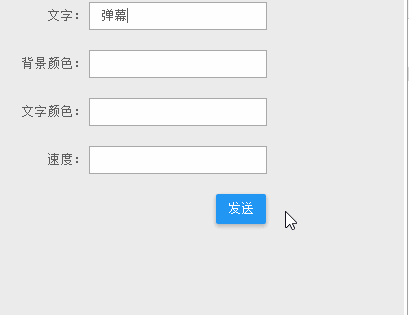

# web-demo-js
对《Web开发实战》这本书中的js相关示例进行了完善和补充，欢迎大家购买这本书，支持作者！

## 《Web开发实战》
这是一本目前为止我看过的最棒的前端实战书籍，其中包含了很多非常实用的例子，同时作者对每一个示例都进行了详尽的解释

* [在线试看地址](https://www.kancloud.cn/dennis/javascriptmethod/261471)
* [购买地址](https://www.kancloud.cn/dennis/javascriptmethod)
* [作者个人博客](http://ghmagical.com/)

## 其他示例
由于示例比较多，放在一个工程中打开的时候加载很慢，所以我将`web-demo`分成了多个repo，具体列表如下：

* [web-demo-js](https://github.com/merrier/web-demo-js)
* [web-demo-css](https://github.com/merrier/web-demo-css)
* [web-demo-mobile](https://github.com/merrier/web-demo-mobile)
* [web-demo-canvas](https://github.com/merrier/web-demo-canvas)
* [web-demo-svg](https://github.com/merrier/web-demo-svg)

## 目录
> 我在这里只会给出代码，并不会给出解释，如果想要了解其中的原理，欢迎购买原书电子版（才￥5，强烈推荐购买！而且如果不购买原书的话，下面的有些原文地址打开是看不到作者的讲解的）

### 点击水波纹

[原文地址](https://www.kancloud.cn/dennis/javascriptmethod/261501)
[在线演示](http://merrier.github.io/web-demo-js/ripple/ripple.html)

### 手风琴布局

[原文地址](https://www.kancloud.cn/dennis/javascriptmethod/261502)
[在线演示](http://merrier.github.io/web-demo-js/collpase/collpase.html)

### 收缩菜单

[原文地址](https://www.kancloud.cn/dennis/javascriptmethod/261503)
[在线演示](http://merrier.github.io/web-demo-js/shrink/shrink.html)

### 滑块

[原文地址](https://www.kancloud.cn/dennis/javascriptmethod/261504)
[在线演示](http://merrier.github.io/web-demo-js/range/range.html)

### 瀑布流

[原文地址](https://www.kancloud.cn/dennis/javascriptmethod/261505)
[在线演示](http://merrier.github.io/web-demo-js/fallwall/fallwall.html)

### 下拉菜单

[原文地址](https://www.kancloud.cn/dennis/javascriptmethod/261506)
[在线演示](http://merrier.github.io/web-demo-js/dropdown/dropdown.html)

### 幻灯片

[原文地址](https://www.kancloud.cn/dennis/javascriptmethod/261507)
[在线演示](http://merrier.github.io/web-demo-js/slide/slide3D.html)

### 选项卡

[原文地址](https://www.kancloud.cn/dennis/javascriptmethod/261508)
[在线演示](http://merrier.github.io/web-demo-js/tab/tab.html)

### 全屏滚动

[原文地址](https://www.kancloud.cn/dennis/javascriptmethod/261509)
[在线演示](http://merrier.github.io/web-demo-js/fullpage/fullpage.html)

### 富文本编辑器

[原文地址](https://www.kancloud.cn/dennis/javascriptmethod/261510)
[在线演示](http://merrier.github.io/web-demo-js/editor/editor.html)

### 带表情输入的评论框

[原文地址](https://www.kancloud.cn/dennis/javascriptmethod/261511)
[在线演示](http://merrier.github.io/web-demo-js/comment/comment.html)

### 图片懒加载

[原文地址](https://www.kancloud.cn/dennis/javascriptmethod/261512)
[在线演示](http://merrier.github.io/web-demo-js/lazyloader/lazyload.html)

### 开启全屏

[原文地址](https://www.kancloud.cn/dennis/javascriptmethod/261513)
[在线演示](http://merrier.github.io/web-demo-js/fullscreen/fullscreen.html)

### 返回顶部

[原文地址](https://www.kancloud.cn/dennis/javascriptmethod/261514)
[在线演示](http://merrier.github.io/web-demo-js/toTop/toTop.html)

### 上传图片预览

[原文地址](https://www.kancloud.cn/dennis/javascriptmethod/261515)
[在线演示](http://merrier.github.io/web-demo-js/uploadReview/uploadReview.html)

### 走马灯

[原文地址](https://www.kancloud.cn/dennis/javascriptmethod/261516)
[在线演示](http://merrier.github.io/web-demo-js/marquee/marquee.html)

### 万年历

[原文地址](https://www.kancloud.cn/dennis/javascriptmethod/261517)
[在线演示](http://merrier.github.io/web-demo-js/calendar/calendar.html)

### 树形菜单

[原文地址](https://www.kancloud.cn/dennis/javascriptmethod/261518)
[在线演示](http://merrier.github.io/web-demo-js/tree/tree.html)

### 旋转加载

[原文地址](https://www.kancloud.cn/dennis/javascriptmethod/261519)
[在线演示](http://merrier.github.io/web-demo-js/circleLoading/circleLoading.html)

### 固定头的表格

[原文地址](https://www.kancloud.cn/dennis/javascriptmethod/261520)
[在线演示](http://merrier.github.io/web-demo-js/table/table.html)

### 圆形水波纹加载进度

[原文地址](https://www.kancloud.cn/dennis/javascriptmethod/261521)
[在线演示](http://merrier.github.io/web-demo-js/rippleLoading/circleLoading.html)

### 检测是否移动端

[原文地址](https://www.kancloud.cn/dennis/javascriptmethod/261522)
[在线演示](http://merrier.github.io/web-demo-js/isMobile/checks.html)

### 搜索过滤

[原文地址](https://www.kancloud.cn/dennis/javascriptmethod/261523)
[在线演示](http://merrier.github.io/web-demo-js/search/filter.html)

### 弹幕

[原文地址](https://www.kancloud.cn/dennis/javascriptmethod/261524)
[在线演示](http://merrier.github.io/web-demo-js/barrage/barrage.html)

### 自定义滚动条

[原文地址](https://www.kancloud.cn/dennis/javascriptmethod/261525)
[在线演示](http://merrier.github.io/web-demo-js/scroll/scroll.html)

### 城市联动选择器

[原文地址](https://www.kancloud.cn/dennis/javascriptmethod/261526)
[在线演示](http://merrier.github.io/web-demo-js/citys/citys.html)

### 滚动监听

[原文地址](https://www.kancloud.cn/dennis/javascriptmethod/266765)
[在线演示](http://merrier.github.io/web-demo-js/scrollSpy/scrollSpy.html)

### 边栏悬浮菜单

[原文地址](https://www.kancloud.cn/dennis/javascriptmethod/266766)
[在线演示](http://merrier.github.io/web-demo-js/scroll_menu/scrollMenu.html)

### 容器上的悬浮效果

[原文地址](https://www.w3cplus.com/css/animate-a-container-on-mouse-over-using-perspective-and-transform.html)
[在线演示](http://merrier.github.io/web-demo-js/suspension/suspension.html)

### 数字时钟效果

[出处](http://www.htmleaf.com/ziliaoku/qianduanjiaocheng/20141221955.html)
[在线演示](http://merrier.github.io/web-demo-js/digitalClock/digitalClock.html)

### 时钟弹珠特效

[出处](http://www.sucaihuo.com/js/2718.html)
[在线演示](http://merrier.github.io/web-demo-js/clockMarbles/clockMarbles.html)

### 今日头条APP顶部点击可居中导航

[出处](http://www.swiper.com.cn/demo/toutiaoNav/index.html)
[在线演示](http://merrier.github.io/web-demo-js/toutiaoTopNav/toutiaoTopNav.html)

### 打飞机小游戏

[在线演示](http://merrier.github.io/web-demo-js/hitAirplane/index.html)

### 图片放大镜

[在线演示](http://merrier.github.io/web-demo-js/magnifier/index.html)

### 图片裁剪

[在线演示](http://merrier.github.io/web-demo-js/imageClipper/index.html)

### QQ面板拖拽

[在线演示](http://merrier.github.io/web-demo-js/panelDrag/index.html)

### 时光轴效果

[在线演示](http://merrier.github.io/web-demo-js/timeAxis/index.html)

### 瀑布流

[在线演示](http://merrier.github.io/web-demo-js/waterfallFlow/index.html)